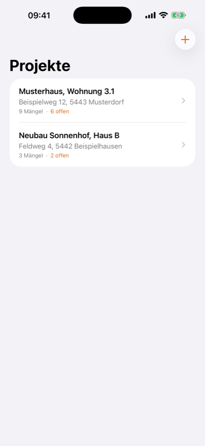
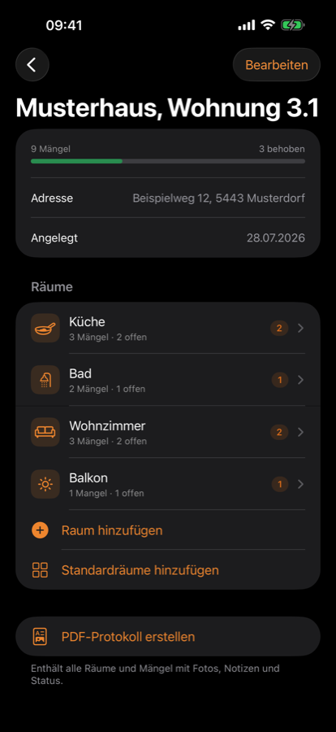
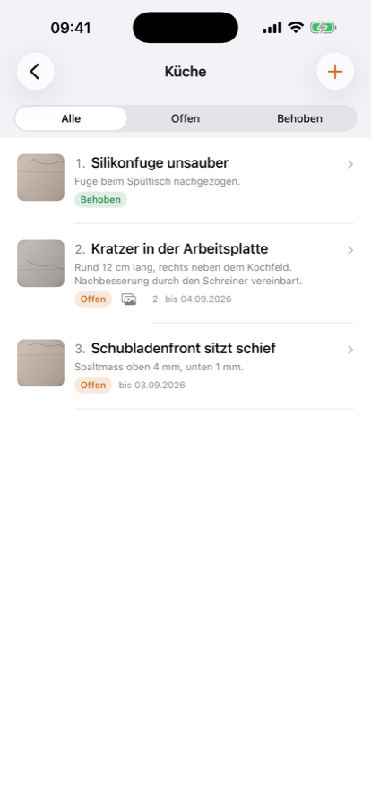
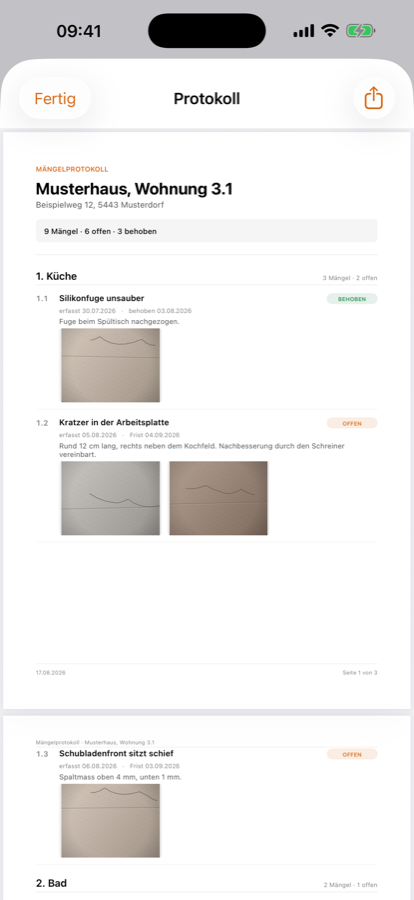

# Baumängel Tracker

**[App Store →](https://apps.apple.com/app/id6802430409)** · **[Website →](https://ipstyle.github.io/baumaengel-tracker/)**

Mängelprotokoll mit Fotodokumentation für das iPhone. Räume anlegen, Mängel mit
Foto und Notiz erfassen, abhaken — und am Schluss ein sauberes PDF-Protokoll
weitergeben.

Gratis · iOS 17+ · Deutsch

Kein Konto, keine Werbung, keine Analyse. Alle Daten und Fotos bleiben auf dem
Gerät.

  
  
  
  

## Funktionen

- **Projekte** — Objekt mit Name, Adresse und Datum; mehrere parallel führen
- **Räume** — je Projekt, in eigener Reihenfolge, mit Fortschritt je Raum
- **Mängel** — Titel, Notiz, Frist, Status offen/behoben mit Behoben-Datum
- **Fotos** — aus der Kamera oder der Mediathek, mehrere je Mangel, im Vollbild
- **PDF-Protokoll** — A4 mit Kopfdaten, Zusammenfassung, Abschnitten je Raum,
  Fotos und Seitenzahlen; teilbar über das System-Teilen
- **Filter** — alle, offen, behoben; überfällige Fristen sind markiert

## Datenschutz

Siehe [PRIVACY.md](PRIVACY.md). Kurzfassung: Die App erfasst nichts, sendet
nichts und braucht kein Konto.

## Support

Fragen oder Fehler melden über die [Issues](https://github.com/ipstyle/baumaengel-tracker/issues)
dieses Repos.

---

© 2026 Albert Frick. All rights reserved. This repository contains no source
code — get the app from the [App Store](https://apps.apple.com/app/id6802430409).
